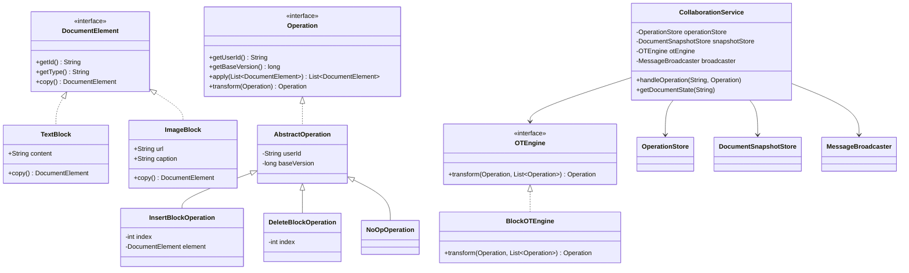
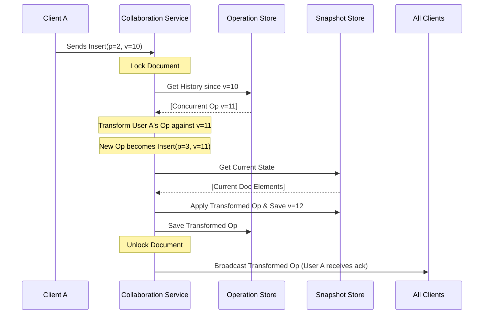

# Collaborative Document Editor

A production-grade, real-time collaborative document editor (like Google Docs) built with Spring Boot and WebSockets. This project focuses on high-performance conflict resolution using **Operational Transformation (OT)** and a strictly **SOLID-compliant** extensible architecture.

## 🚀 Key Features

- **Real-time Collaboration**: Multiple users can edit the same document simultaneously.
- **Conflict Resolution**: OT Engine handles concurrent edits without locking the document.
- **Extensible Block Architecture**: Supports `Text` and `Image` blocks by default, with an architecture ready for `Video`, `Tables`, and more.
- **Event Sourcing**: Every operation is versioned and stored, allowing for full document history.

---

## 🏗️ System Architecture & Class Diagram

The system is designed with a high degree of decoupling. The core logic (OT) is separated from the communication (WebSockets) and storage (Snapshots/History).



---

## 🔄 Application Flow (Operational Transformation)

When a client sends an update, the the server ensures that it is "transformed" against any other changes that happened since the client last synced.



---

## 🛠️ Design Principles (SOLID)

1.  **Single Responsibility Principle (SRP)**:
    - `OTEngine` handles only the math of conflict resolution.
    - `OperationStore` handles only the persistence of history.
    - `CollaborationService` orchestrates the flow without knowing *how* transformations happen.

2.  **Open/Closed Principle (OCP)**:
    - Adding a new content type (e.g., `TableBlock`) requires **zero** changes to the the core `CollaborationService`. You simply implement the `DocumentElement` interface.

3.  **Liskov Substitution Principle (LSP)**:
    - All `Operation` implementations (`Insert`, `Delete`, `NoOp`) can be used interchangeably by the transformation engine.

4.  **Dependency Inversion Principle (DIP)**:
    - `CollaborationService` depends on abstract interfaces (`OperationStore`, `MessageBroadcaster`) rather than concrete implementations (JDBC, WebSocket). This allows switching from In-Memory to Postgres/Kafka with minimal effort.

---

## 🚦 Getting Started

### Prerequisites
- Java 17+
- Maven (or use `./mvnw`)

### Running the Application
```bash
./mvnw clean spring-boot:run
```

The WebSocket endpoint is available at `/ws-document`. Clients can subscribe to titles via `/topic/document/{documentId}`.
